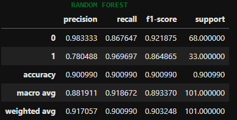

# Twitter Sentiment Analysis of the Citizenship Amendment Act
This project focuses two aspects: 
* Creating a dataset by collecting tweets from the Twitter API. The code utilizes Python to interact with the API, retrieve tweet data based on specific keywords and time ranges, and store the data in a CSV file. The collected dataset can be used for various purposes, such as sentiment analysis or trend analysis.
* Sentiment analysis using a random forest algorithm. The goal is to classify tweets into two categories: pro CAA (Citizenship Amendment Act) and against CAA. The project utilizes a dataset of labeled tweets for training and testing the model. The sentiment analysis is performed by preprocessing the tweets, removing usernames, punctuation, numbers, and special characters. The tweets are tokenized, stemmed, and processed to remove stopwords. Finally, a random forest classifier is trained on the processed data to classify new tweets.

# Languages and Frameworks/Libraries
The project is implemented in Python, using the following frameworks/libraries:
* **numpy**
* **pandas**
* **requests**
* **json**
* **csv**
* **datetime**
* **dateutil.parser**
* **unicodedata**
* **seaborn**
* **nltk**
* **wordcloud**
* **matplotlib**


# Installation and Execution
To run this project locally, follow these steps:

1. Ensure that Python 3 is installed on your system.
2. Clone the project repository from GitHub.
3. Install the required libraries by running the following command:
```
pip install numpy pandas requests
```
4. Set up a Twitter Developer account and obtain the necessary API credentials.
5. Replace the placeholder bearer token in the code with your own API bearer token.
6. Customize the keyword, start date, end date, and other parameters according to your requirements.
7. Execute the dataset_creation.ipynb notebook.
8. The collected tweet data will be saved in the data.csv file.


# Configuration
To use the project, follow these steps:

1. Make sure you have completed the installation and execution steps mentioned above.
2. Once the code is executed, the dataset will be created and saved in the data.csv file.
3. You can access the collected tweet data for further analysis or processing.
4. The dataset can be loaded into various data analysis or machine learning frameworks for tasks such as sentiment analysis, classification, or trend analysis.
5. Open the Jupyter Notebook **randomforest.ipynb**.
6. Run each cell in the notebook sequentially to perform data preprocessing, training the random forest classifier, and analyzing the results.
7. Modify the notebook code to use your own dataset or make customizations as needed.

# Snapshots
## Sample Wordcloud Generated


## Tokenised Predictions


## Performance of the Model


# Conclusion
This project provides a convenient way to collect and create a dataset of tweets using the Twitter API. By specifying keywords, time ranges, and other parameters, you can easily retrieve relevant tweet data and store it in a CSV file. The collected dataset can be used for various data analysis tasks or as training data for machine learning models. The random forest sentiment analysis project provides a way to classify tweets into pro CAA and against CAA categories. By utilizing a random forest algorithm and performing preprocessing techniques such as tokenization, stemming, and stopwords removal, the model can effectively analyze sentiment in tweets. The project's code and analysis can serve as a starting point for further research and development in sentiment analysis and text classification tasks.
